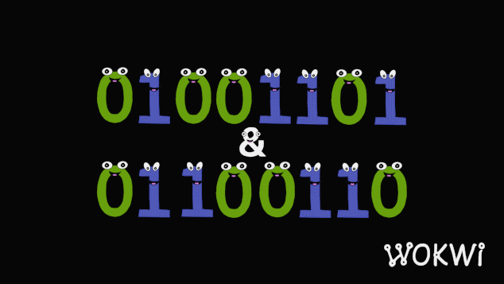
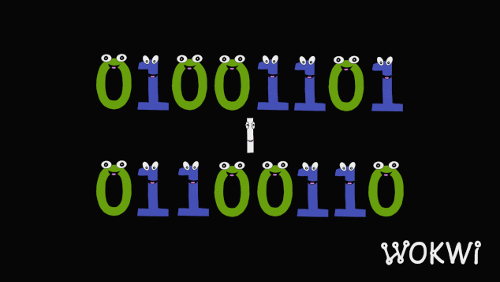
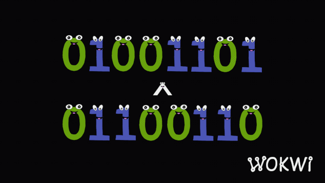

# Bit Manipulation

## Properties of bitwise operations

Bit operations have many properties. Here, we will list common properties of **AND**, **OR**, **XOR**, and **negation** in bit operations. We assume that the variables below are all signed integers.

`Idempotent law`:

```python
    a & a = a
    a | a = a
```

- note that **XOR** does not satisfy the **idempotent law**

`Commutative law`:

```markdown
    a & b = b & a
    a | b = b | a
    a ⊕ b = b ⊕ a
```

`Associativity`:

```markdown
    (a & b) & c = a & (b & c)
    (a | b) | c = a | (b | c)
    (a ⊕ b) ⊕ c = a ⊕ (b ⊕ c)
```

`Distributive Law`:

```markdown
    (a & b) | c = (a | c) & (b | c)
    (a | b) & c = (a & c) | (b & c)
    (a ⊕ b) & c = (a & c) ⊕ (b & c)
```

`De Morgan's Law`:

```markdown
    ∼ (a & b) = (∼a) | (∼b)
    ∼ (a | b) = (∼a) & (∼b)
```

`Negative operation properties`:

```markdown
    -1 = ∼0
    -a = ∼(a−1)
```

`AND operation properties`:

```markdown
    a & 0 = 0
    a & (-1) = a
    a & (∼a) = 0
```

`OR operation properties`:

```markdown
    a | 0 = a
    a | (∼a) = −1
```

`XOR operation properties`:

```markdown
    a ⊕ 0 = a
    a ⊕ a = 0
```

`Other properties`:

```markdown
    The result of a & (a−1) is to change the last 1 in the binary representation of a to 0
```

```markdown
    The result of a & (-a) (equivalent to a & (∼(a−1))) is to keep only the last 1 of the binary representation of a, and set the remaining 1s to 0.
```

## Visualization

## `Left shift << Shifts bits to the left (multiplies by 2)`


## `Right shift >> Shifts bits to the right (divides by 2)`


## `AND & Returns 1 if both bits are 1`



## `NOT ~ Inverts the bits 1 becomes 0 and 0 becomes 1`


## `OR | Returns 1 if at least one bit is 1`



## `XOR ^ Returns 1 if the bits are different`



## Best explanations

YouTube:

1. [Greg Hogg: Binary Numbers and Bit Manipulation - DSA Course in Python Lecture 16](https://www.youtube.com/watch?v=H_NCHm3wAMI)
2. ~
3. ~

Leetcode:

1. [Bit Manipulation card](https://leetcode.com/explore/learn/card/bit-manipulation/)

## Litcode Problems

[**Leetcode Bit Manipulation problem list**](https://leetcode.com/problem-list/bit-manipulation/)

1. [2683. Neighboring Bitwise XOR](https://leetcode.com/problems/neighboring-bitwise-xor/description/?envType=problem-list-v2&envId=bit-manipulation)
2. [2425. Bitwise XOR of All Pairings](https://leetcode.com/problems/bitwise-xor-of-all-pairings/description/?envType=problem-list-v2&envId=bit-manipulation)
3. [2429. Minimize XOR](https://leetcode.com/problems/minimize-xor/description/?envType=problem-list-v2&envId=bit-manipulation)
4. [67. Add Binary](https://leetcode.com/problems/add-binary/description/?envType=problem-list-v2&envId=bit-manipulation)
5. [78. Subsets](https://leetcode.com/problems/subsets/description/?envType=problem-list-v2&envId=bit-manipulation)
