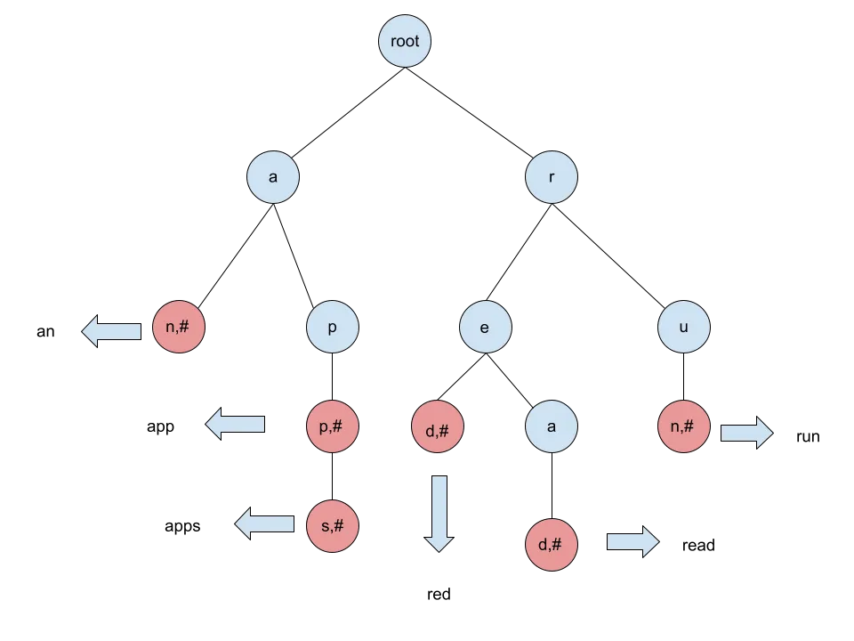
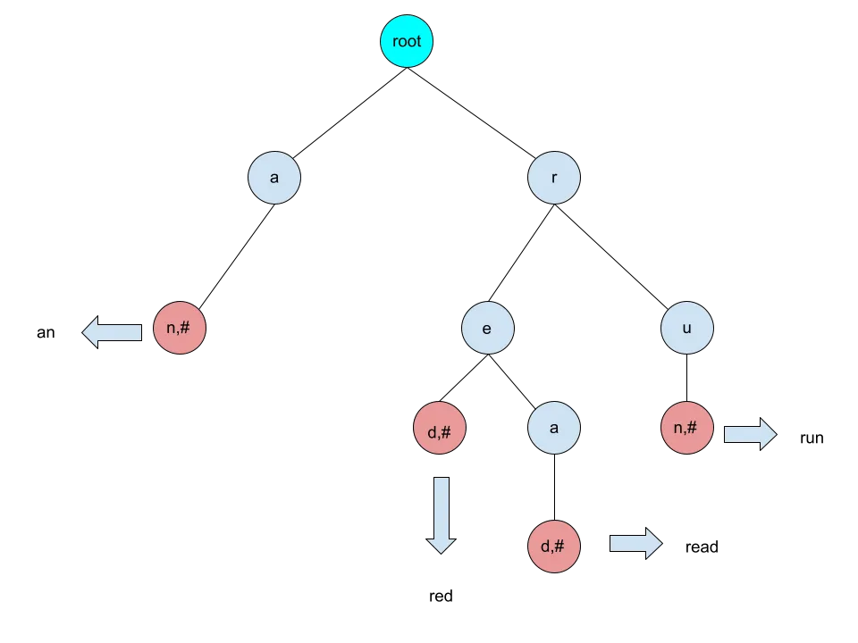
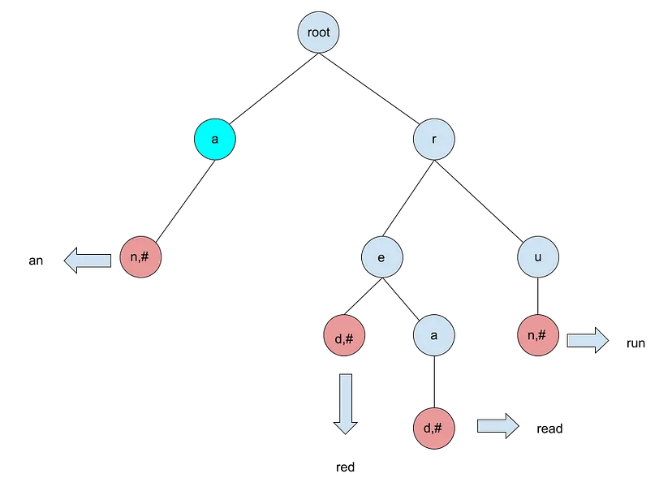
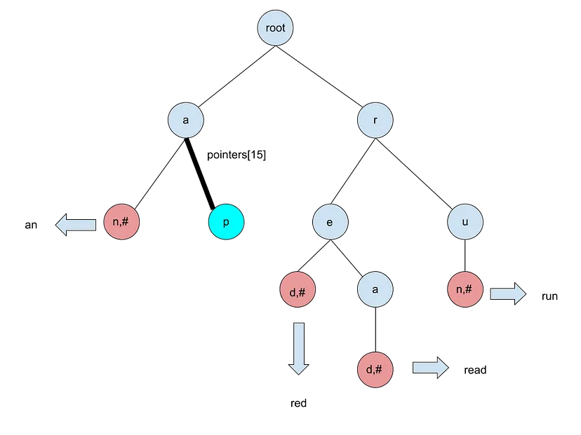
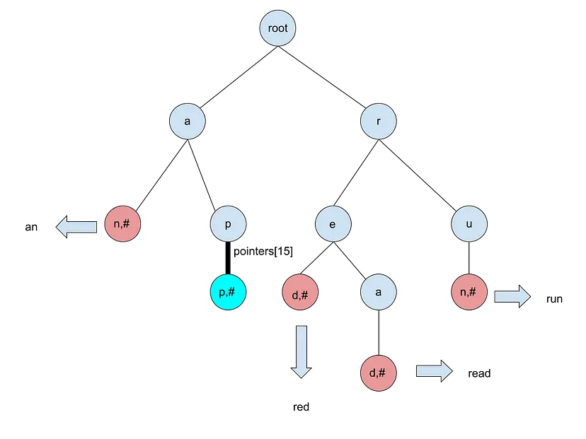
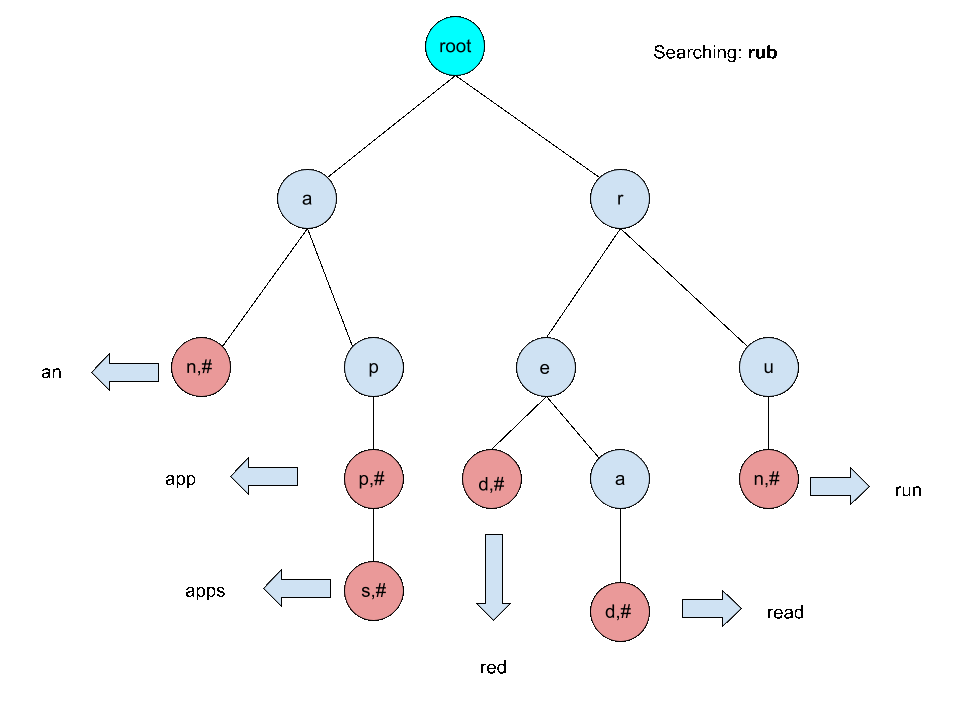

# Trie

## Properties of trie

### What is a Trie?

A **Trie**, also known as a **prefix tree** or **digital tree**, is a specialized tree-like data structure used to store a dynamic set of strings, where the keys are usually strings. It is particularly useful for tasks involving prefix searches, such as autocomplete and spell checking.

### Key Properties of a Trie

1. **Structure**:
   - A **Trie** consists of nodes, where each node represents a single character of a string.
   - The root node represents an empty string, and each path from the root to a node represents a prefix of the strings stored in the **Trie**.

2. **Storage**:
   - Each node can have multiple children, corresponding to the possible characters that can follow the prefix represented by that node.
   - The number of children for each node depends on the character set used (e.g., 26 for lowercase English letters, 256 for extended ASCII).

3. **Time Complexity**:
   - **Insertion**: `O(m)`, where `m` is the length of the string being *inserted*.
   - **Search**: `O(m)`, where `m` is the length of the string being *searched*.
   - **Deletion**: `O(m)`, where `m` is the length of the string being *deleted*.
   - The time complexity is independent of the number of strings stored in the **Trie**.

4. **Space Complexity**:
   - The space complexity can be `O(n * m)` in the worst case, where `n` is the number of strings and `m` is the maximum length of the strings. However, space can be optimized using techniques like compression (e.g., **Ternary Search Tree** or **Patricia Trie**).

5. **Prefix Searches**:
   - **Tries** are efficient for prefix-based queries, allowing for quick retrieval of all strings that share a common prefix.
   - This makes **Tries** ideal for applications like autocomplete systems.

6. **No Duplicates**:
   - A **Trie** does not store duplicate strings. Each unique string is stored only once, which can save space compared to other data structures like hash tables.

7. **Case Sensitivity**:
   - **Tries** can be *case-sensitive* or *case-insensitive*, depending on how they are implemented. This can affect the number of nodes created.

8. **Applications**:
   - Autocomplete systems
   - Spell checkers
   - IP routing
   - Longest common prefix problems
   - Dictionary implementations

## Conclusion

**Tries** are a powerful data structure for efficiently storing and retrieving strings, especially when dealing with prefix-based queries. Their unique properties make them suitable for a variety of applications in computer science and software development.

## Visualization

**Trie** is a *tree-based* data structure used for efficiently retrieving a key from a large set of strings. **Trie** differs from similar *tree-based* structures by having the position of it’s nodes determine their associated key. The **nodes** of a **Trie** do not hold a key themselves.

**Nodes**: Each **node** of the tree contains an array of child pointers(will be named pointers[] for all examples). The size of the array or amount of pointers is determined by the unique number of characters present in the dataset you want to store (lowercase only English — 26 pointers). Each node also contains a flag that specifies if it is the end of a key or not.

Below is a basic **Trie** diagram with the following keys inserted: `an`, `app`, `apps`, `red`, `read`, `run`.

> Diagram of a **Trie**: nodes containing **#** have their ending flags set as true

### Insertion

Insertion begins by starting at the **root node** of the tree and walking through the **Trie** according the string that is being inserted. New **nodes** are created when a pointer for the next string’s character is null. When we reach the final character of a key being inserted, we create the **node** as usual but we also set the flag marking the **node** as the end of a key to true.

Lets walk through the process of adding the keys “`app`, `apps`”. Beginning with “`app`”, we start at the `root` of the tree that doesn’t represent any character.

We check `root’s` array of pointers to see if the pointer corresponding to `app’s` first character (`a`) points to a existing **node**.

We see that the **node** for `a` exists and was created from the previous insertion of key `an`.

Proceeding we go to `app’s` next letter `p`, we can see there is no **node** for `p` at our current **node** of `a` so we must create it.

We create the **node** for `p` and set the appropriate pointer from `a’s` array of pointers to point to this newly created **node** (since `p` is the 16th letter of the alphabet we would set *pointers[15]* to point to this new **node**).

Keep in mind the **nodes** do not actually contain their respective characters but instead a pointer’s position in the array implies its character (*pointers[0]* — `a`, *pointers[1]* — `b`,….,*pointers[25]* — `z`). We’ll see later how we can search for words in our **Trie** just by checking for the existence of certain **nodes**.

Proceeding with `app’s` third letter, another `p`, we create a new **node** and set the appropriate pointer from the previous `p’s` array of pointers to point to this new **node**

Since this is the last letter of `app`, we also set this **node’s** end flag as true. This completes the insertion of key `app`, we go through the same process to insert `apps`.

After both insertions are completed, we get our original **Trie** diagram.

### Searching

*Searching* for a key is very similar to *inserting* a key in a **Trie**. When searching, we traverse the **Trie** starting from the `root` and continue through the **nodes** according to the key’s characters. We can say the key does not exist in the **Trie** if while traversing through the tree with our key of choice we get a nullptr along our path or the last **node** we reach with our key does not have its end flag set as true. Likewise if the final **node** we reach exists and it is marked as an end **node**, we can say the key exists in the **Trie**.

Lets begin with searching for a key that doesn’t exist on the tree: `rub`

Looking at the diagram we can see at we start at the `root` of the **Trie** and traverse down according to the key’s characters. We go from `root` to **node** `r` then to node `u`. When we access the pointer corresponding with `b` at the current node of `u`, we see that it is a nullptr not pointing to anything. Since we’ve encountered a nullptr we can say the key does not exist in our **Trie** and return false for our search

Now lets search for a key that doesn’t lead to a nullptr but still returns false: `rea`

We can see that while traversing the tree we do not encounter a nullptr but when we reach the end of the key we stop at **node** that isn’t marked as an end node. This means that although the path exists, the key has not been added to the **Trie** and thus searching for it returns false.

We can run through the **Trie** one more time searching for a key that does exist: `apps`

We are able to traverse the **Trie** without encountering a nullptr and the last **node** we visit is marked as an end **node**. The key has been found and we return true.

[Original article](https://medium.com/smucs/trie-data-structure-fd2de3304e6e)

[Visualization from the University of San Francisco](https://www.cs.usfca.edu/~galles/visualization/Trie.html)

[Visualization from the ai_gallery](https://gallery.selfboot.cn/en/algorithms/trie)

## Best explanations

YouTube:

1. [Greg Hogg: Implement Trie (Prefix Tree) - Leetcode 208 - Trees (Python)](https://www.youtube.com/watch?v=8mhw5WT2x0U)
2. ~
3. ~

Leetcode:

1. [Trie card](https://leetcode.com/explore/learn/card/trie/)

## Litcode Problems

[**Trie problem list**](https://leetcode.com/problem-list/trie/)

1. [208. Implement Trie (Prefix Tree)](https://leetcode.com/problems/implement-trie-prefix-tree/description/?envType=problem-list-v2&envId=trie)
2. [14. Longest Common Prefix](https://leetcode.com/problems/longest-common-prefix/description/?envType=problem-list-v2&envId=trie)
3. [1233. Remove Sub-Folders from the Filesystem](https://leetcode.com/problems/remove-sub-folders-from-the-filesystem/description/?envType=problem-list-v2&envId=trie)
4. [3042. Count Prefix and Suffix Pairs I](https://leetcode.com/problems/count-prefix-and-suffix-pairs-i/description/?envType=problem-list-v2&envId=trie)
5. [677. Map Sum Pairs](https://leetcode.com/problems/map-sum-pairs/description/?envType=problem-list-v2&envId=trie)
